# Privacy-Preserving AI Bounty Judge

This submission updates the workshop `AIJudge` contract from public answer submissions to a commit-reveal bounty flow. The goal is to keep answers hidden during the submission phase so later participants cannot copy earlier ideas before judging.

## Lifecycle

1. The bounty owner creates a bounty with a title, rubric, reward, submission deadline, and reveal deadline.
2. Before the submission deadline, each participant calls `submitCommitment(uint256 bountyId, bytes32 commitment)`.
3. The commitment is computed as `keccak256(abi.encodePacked(answer, salt, msg.sender, bountyId))`.
4. The plaintext answer and salt stay off-chain during the submission phase.
5. After the submission deadline and before the reveal deadline, the participant calls `revealAnswer(uint256 bountyId, string calldata answer, bytes32 salt)`.
6. The contract recomputes the commitment and stores the answer only if the reveal matches the original commitment.
7. After the reveal deadline, the owner calls `judgeAll(uint256 bountyId, bytes calldata llmInput)`.
8. Ritual AI receives the revealed submissions in one batch judging request. Unrevealed commitments are not eligible.
9. After judging is complete, the owner calls `finalizeWinner(uint256 bountyId, uint256 winnerIndex)` and the contract pays the reward to one revealed submission.

## Contract Rules Implemented

- Commitments can only be submitted before `submissionDeadline`.
- Answers can only be revealed after `submissionDeadline` and before `revealDeadline`.
- Each address can submit only one commitment per bounty.
- A reveal is valid only when the recomputed commitment matches the stored commitment.
- Unrevealed submissions remain ineligible for judging and payout.
- The owner can judge only after the reveal deadline.
- The owner can finalize only after judging is complete.
- The winner index must point to a revealed submission.
- The reward is set to zero before the external payment call to avoid double payout.

## Test Plan

The required test coverage should include these cases:

1. Create bounty succeeds when the reward is nonzero, `submissionDeadline` is in the future, and `revealDeadline` is after `submissionDeadline`.
2. Create bounty reverts when there is no reward.
3. Create bounty reverts when the reveal deadline is before or equal to the submission deadline.
4. `submitCommitment` succeeds before the submission deadline and emits `CommitmentSubmitted`.
5. `submitCommitment` reverts after the submission deadline.
6. `submitCommitment` reverts when the same participant tries to commit twice for the same bounty.
7. `revealAnswer` reverts before the submission deadline.
8. `revealAnswer` succeeds during the reveal phase with the correct answer, salt, submitter, and bounty id.
9. `revealAnswer` reverts with the wrong salt, wrong answer, or wrong caller.
10. `revealAnswer` reverts after the reveal deadline.
11. `judgeAll` reverts before the reveal deadline.
12. `judgeAll` reverts if no submission was validly revealed.
13. `finalizeWinner` reverts before judging is complete.
14. `finalizeWinner` reverts if `winnerIndex` points to an unrevealed submission.
15. `finalizeWinner` pays exactly one revealed winner and cannot be called a second time.

## Architecture Note: Commit-Reveal vs Ritual-Native Hidden Submissions

The required commit-reveal track is portable across EVM chains because the chain only needs to store hashes during the submission phase and verify reveals later. Its main limitation is that plaintext answers become public during the reveal phase, before `judgeAll()` runs. This still prevents copying during the original submission window, but it does not fully hide answers until AI judging is complete.

A Ritual-native advanced design can keep plaintext answers hidden longer. Participants encrypt their answers for a Ritual TEE executor or a Ritual privacy/key flow and submit either encrypted blobs or references to encrypted off-chain objects. On-chain storage should contain compact data such as submitter addresses, ciphertext references, ciphertext hashes, and status flags rather than large plaintext answers. During `judgeAll()`, the TEE workflow privately decrypts all eligible submissions, builds one batch prompt, and sends all submissions to the LLM together. The LLM should not be called once per answer because that makes comparative judging weaker and creates inconsistent context between submissions.

Plaintext answers exist only on the participant device before submission and inside the Ritual-backed private execution environment during judging. Other participants and public chain observers should see only commitments, encrypted references, hashes, and final results. After judging, the system can reveal all answers together by publishing an off-chain bundle such as `ipfs://...` plus `revealedAnswersHash` on-chain. The contract can commit to the final bundle by storing the hash, while the owner still finalizes the payout after reviewing the AI recommendation.

```mermaid
flowchart LR
    A["Participant answer"] --> B["Encrypt for Ritual TEE"]
    B --> C["Store ciphertext or off-chain reference"]
    C --> D["Contract stores reference and hash"]
    D --> E["judgeAll after deadline"]
    E --> F["TEE decrypts all submissions privately"]
    F --> G["One batch LLM judging request"]
    G --> H["AI returns ranking and winner recommendation"]
    H --> I["Publish final answer bundle and hash"]
    I --> J["Owner finalizes one winner"]
```



## Reflection

In a bounty system, public data should include the bounty rules, reward amount, deadlines, judging rubric, participant commitments, final winner, and payout transaction. Submissions should stay hidden while participants are still competing so that later entrants cannot copy or slightly improve earlier answers. Salts, plaintext answers, encrypted storage credentials, and any private judging inputs should remain hidden until the protocol reaches the intended reveal point. AI should help compare submissions against the rubric, summarize tradeoffs, and recommend a ranking because it can review many answers consistently in one batch. A human owner should still make the final payout decision because the owner is responsible for interpreting edge cases, checking whether the AI result is sensible, and handling disputes. The contract should enforce objective rules such as deadlines, valid reveals, eligibility, and one-time payout. Humans should decide policy and accountability, while AI should assist with evaluation rather than become the sole authority over funds.

## Local Usage

Install dependencies and run the Hardhat checks from the `hardhat` directory:

```shell
pnpm install
pnpm hardhat compile
```
